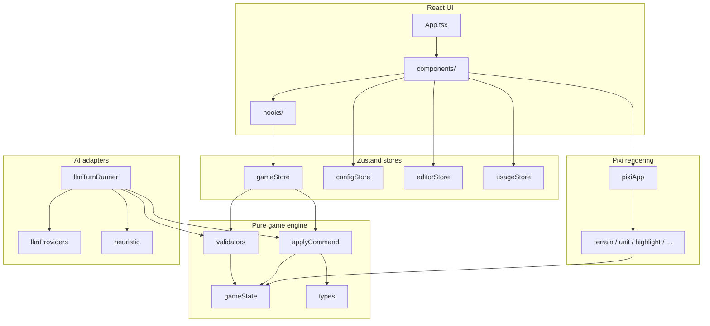

# Modern AW — Architecture

This document describes how the application is structured, how data flows, and where responsibilities live. Operational rules and common mistakes are kept in [CLAUDE.md](../CLAUDE.md); this file is the **mental map** of the codebase.

---

## Stack (current)

| Layer           | Technology                                 |
| --------------- | ------------------------------------------ |
| UI              | React 19, Tailwind CSS 4                   |
| Build / dev     | Vite 7                                     |
| Desktop         | Electron (main + preload; packaged builds) |
| Match rendering | Pixi.js v8 (client-only)                   |
| Client state    | Zustand                                    |
| Tests           | Vitest (unit), Playwright (e2e)            |

The entry point for the web UI is [`index.html`](../index.html) → [`src/main.tsx`](../src/main.tsx) → [`src/App.tsx`](../src/App.tsx). Game data JSON is served from `public/data/` and sprite assets from `public/sprites/`.

**Online multiplayer** is not implemented in this repo yet; planned approach and PartyKit notes live in [ROADMAP.md](ROADMAP.md).

---

## Layered architecture



**Principle:** `src/game/` has **no** React, Pixi, or Zustand imports. It is deterministic, testable, and portable. The UI and Pixi layers **observe** game state and **submit** commands; they do not mutate `GameState` except through `validateCommand` → `applyCommand`.

---

## Command pipeline (single source of truth)

Every legal action is a **command** (`src/game/types.ts` — discriminated union). The pipeline is always:

1. **`validateCommand(state, cmd)`** — [`validators.ts`](../src/game/validators.ts) — is this legal right now?
2. **`applyCommand(state, cmd)`** — [`applyCommand.ts`](../src/game/applyCommand.ts) — produce a **new** immutable `GameState`.

Nothing else should apply commands to authoritative state (no ad-hoc `unit.x = …` in UI). AI paths (heuristic / LLM) use the same pipeline after producing command objects.

---

## State stores (what each is for)

| Store             | Role                                                                                                                       |
| ----------------- | -------------------------------------------------------------------------------------------------------------------------- |
| **`gameStore`**   | Active match: `GameState`, selection, reachable/attack tiles, fog snapshot, command queue for animations, `submitCommand`. |
| **`configStore`** | API keys, default models, local Ollama URL; persisted (Electron: secure storage where applicable).                         |
| **`editorStore`** | Map editor draft map, brush, undo/redo; isolated until “play test” pushes into the match flow.                             |
| **`usageStore`**  | Token usage history for analytics (no dollar estimates).                                                                   |

Match UI should use **`useGameStore`** for game state, not React `useState` for positions or HP.

---

## Rendering (Pixi)

- **Initialization and assets:** [`src/rendering/pixiApp.ts`](../src/rendering/pixiApp.ts) — application singleton, sprite sheets, pan/zoom.
- **World:** [`terrainRenderer.ts`](../src/rendering/terrainRenderer.ts), [`unitRenderer.ts`](../src/rendering/unitRenderer.ts), [`highlightRenderer.ts`](../src/rendering/highlightRenderer.ts), [`movementAnimator.ts`](../src/rendering/movementAnimator.ts), [`combatAnimator.ts`](../src/rendering/combatAnimator.ts).
- **Input:** [`inputHandler.ts`](../src/rendering/inputHandler.ts) maps pointer events to tile coordinates.
- **Mapping:** [`spriteMapping.ts`](../src/rendering/spriteMapping.ts) — game IDs ↔ WarsWorld frame names (roads/rivers bitmask, buildings, units).

Pixi must only load in **client** contexts (e.g. components that mount the canvas). The match surface is orchestrated from [`GameCanvas.tsx`](../src/components/match/GameCanvas.tsx).

---

## Data loading

| Context                       | Module                                                   | Notes                                                                                       |
| ----------------------------- | -------------------------------------------------------- | ------------------------------------------------------------------------------------------- |
| Browser                       | [`dataLoader.ts`](../src/game/dataLoader.ts)             | `loadGameData()` once; then `getTerrainData` / `getUnitData` are synchronous.               |
| Node (if used for tools/APIs) | [`serverDataLoader.ts`](../src/game/serverDataLoader.ts) | Reads `public/data/*.json` via `fs` and feeds the same in-memory cache as the browser path. |

Calling getters before `loadGameData()` completes yields `null` and subtle bugs — see CLAUDE.md.

---

## AI

| Piece                                                | Purpose                                                              |
| ---------------------------------------------------- | -------------------------------------------------------------------- |
| [`llmProviders.ts`](../src/ai/llmProviders.ts)       | Anthropic / OpenAI / Gemini / Ollama; Electron IPC when available.   |
| [`llmTurnRunner.ts`](../src/ai/llmTurnRunner.ts)     | Batch model output → validated commands → apply; fallback heuristic. |
| [`heuristic.ts`](../src/ai/heuristic.ts)             | Offline AI, no network.                                              |
| [`stateSerializer.ts`](../src/ai/stateSerializer.ts) | Compact text view of state for prompts.                              |
| [`mapGenerator.ts`](../src/ai/mapGenerator.ts)       | LLM-assisted AWBW-style maps for the editor.                         |

---

## Electron

- **[`electron/main.ts`](../electron/main.ts)** — window, filesystem saves, optional **secure** AI API calls so keys are not exposed in the renderer.
- **[`electron/preload.ts`](../electron/preload.ts)** — exposes a narrow `window.electronAPI` to the renderer.

When the app runs in a normal browser, features that depend on `electronAPI` degrade gracefully (e.g. autosave, encrypted keys).

---

## Tests

- **Unit:** `src/tests/` — game rules with mocked `dataLoader` and fixtures in `fixtures.ts` / `mockData.ts`.
- **E2E:** `e2e/` — Playwright against production build.

---

## Directory map (quick reference)

```
src/
  game/          # Pure engine: types, validators, applyCommand, combat, pathfinding, …
  rendering/     # Pixi: layers, animators, input
  components/      # React UI (match/, setup/, editor/, agentConfigurationAndAnalytics/, shared/)
  store/         # Zustand
  hooks/         # useGame, keyboard, timer, autosave
  ai/            # LLM + heuristic
  lib/           # Shared helpers (format, team colors, pings, …)
electron/        # Main + preload
public/data/     # terrain.json, units.json
public/sprites/  # Atlases + WarsWorld sheets
```

---

## Related docs

- [CLAUDE.md](../CLAUDE.md) — rules, don’ts, verification checklist
- [docs/units.md](units.md) — unit reference (if maintained)

---

_When you change how commands flow, how stores interact, or the build stack, update this file so onboarding and AI tooling stay accurate._
